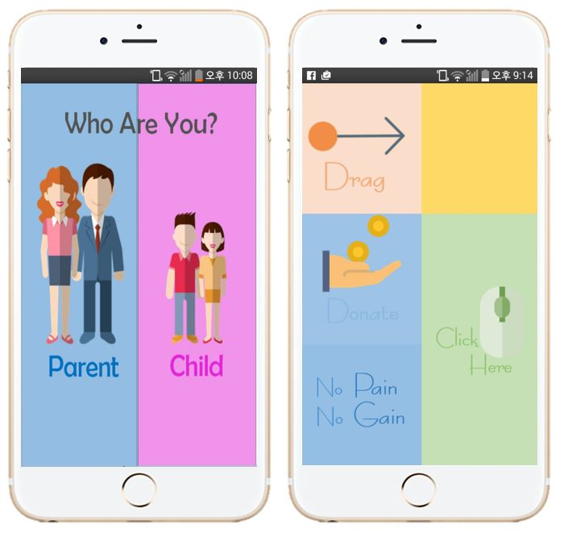
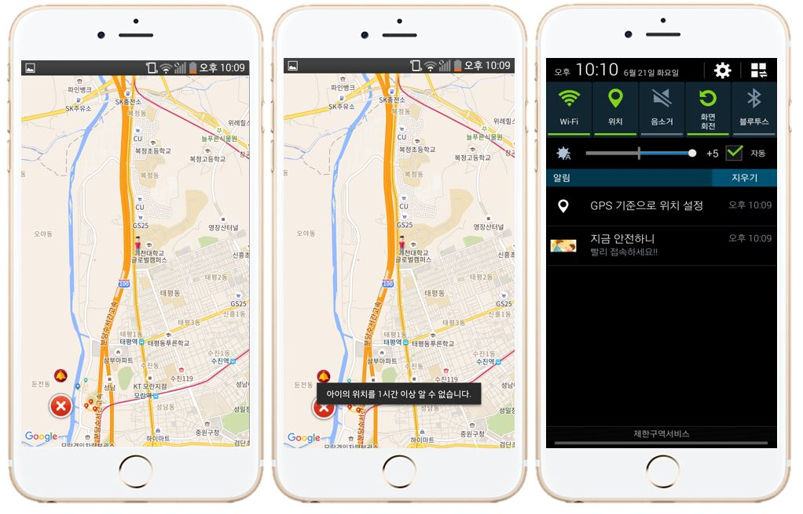
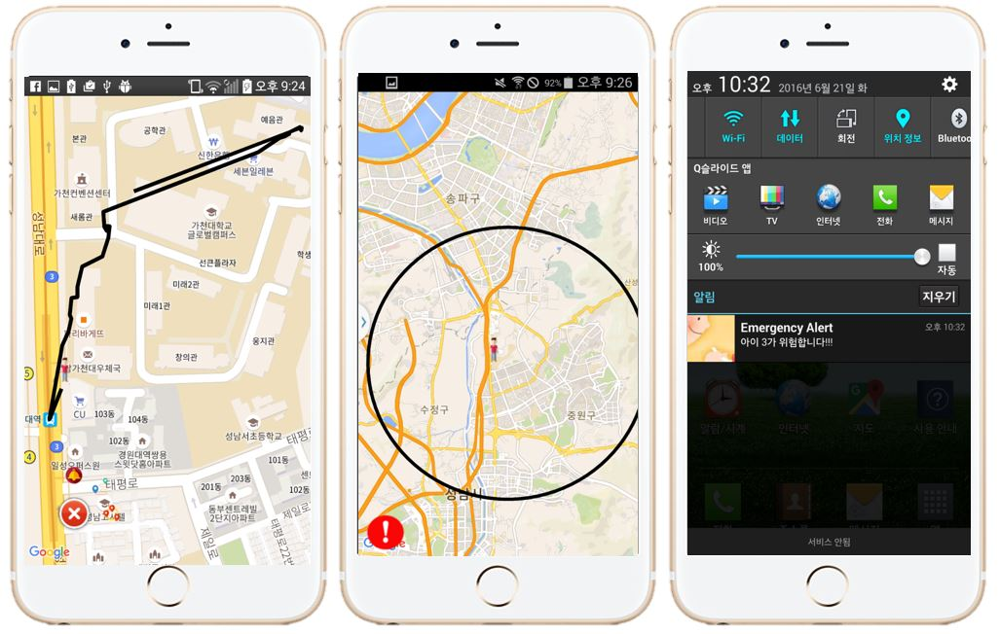
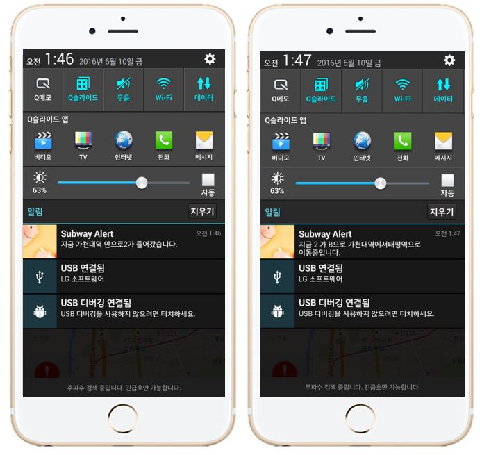

# Are-You-Safe

## Motivation
- There was a case that a man was found dead a week after he went to reserve army training and disappeared.
- We look at these events and it takes a week for ordinary people to disappeared and found.
- We came up with this app thinking that the disappearance of people who are uncomfortable, such as children or the elderly, is more frequent and difficult to find.

## Description
- The application has two states of guardian and ward.
- The guardian has a relationship with several ward and is informed of the status of the ward at any time.

## Language
- Client : Android
- Server : Node.js, MongoDB
- Api : Google map, Seoul open data

## Function

- User interface
  + we focus on easy to use.
  + simple and intuitive UI

- Location of Ward
  + If online, show real-time location
  + If not, show latest location
- Click Button
  + on & off Push message
  + Trace specific time location
  + Set danger zone
- Push Alarm
  + Out of danger zone
  + Emergency button clicked
  + Not updated more than 1 hour
  + Enter the subway station

- Trace of specific Time
  + Want to know past location
  + Keep the route just 1 minutes

- Safety Zone
  + Long clicks specific location
  + Out of bound, gcm to parents
  + Create, Delete, Check

- Inside of Subway
  + Location of underground is wired
  + Whether up train or not
  + Out of bound, gcm to parents

